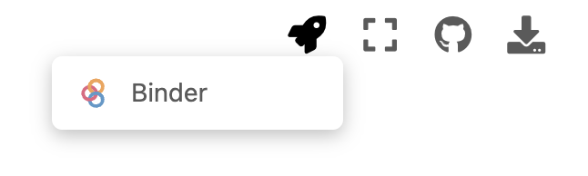

# Bad luck, bad drug or bad heart: Computer models to the rescue
> Workshop on Digital Scholarship Days at UiO Friday January 13th 2023

- Documentation: https://computationalphysiology.github.io/uio-digital-scholarship-days

## Run notebooks with binder
In this document you will see the *launch binder* badge 
If you click on this it will open the main repo in jupyterlab using Binder which will give you a notebook environment where you can run the notebooks in this repo.

## Run notebooks directly from the documentation page
If you visit the documentation at https://computationalphysiology.github.io/uio-digital-scholarship-days then you will see a rocket icon at the top of the page for the pages that contain an interactive notebook

Clicking on the binder icon will also launch the current notebook in Binder.

## Authors
- Ilsbeth Gerarda Maria van Herck
- Henrik Finsberg
- Hermenegild Arevalo

## License

This repo is licensed using a CC-BY so you are free to use, remix, and share so long attribution is provided to the original author.
